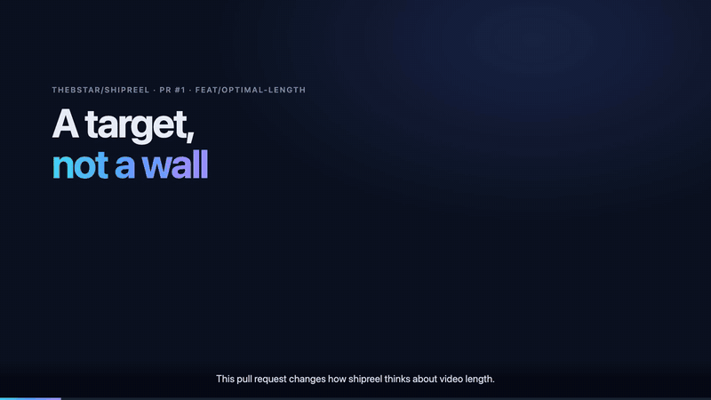

# shipreel

**Turn a pull request into a short narrated walkthrough video.** An agent skill: your coding agent reads the diff, writes the story, draws the diagrams, records the real app if the change has a UI, and renders a compact MP4, about two and a half minutes by default, with captions, crossfade cuts and an ambient music bed.

Reviewers watch the change instead of reverse-engineering it.

[](examples/pr-1/shipreel-pr-1.mp4)

*The video shipreel made for its own [PR #1](https://github.com/theBstar/shipreel/pull/1): a small change, so 50 seconds. [Watch the full video](examples/pr-1/shipreel-pr-1.mp4) · [its scenes](examples/pr-1/scenes.mjs).*

- **Free and local by default.** Narration uses your machine's voice; music is synthesized; rendering is headless Chrome and ffmpeg. No API keys, no uploads.
- **Zero setup on a Mac.** Chrome in `/Applications` and macOS `say` are found automatically. Everything else is a line in `shipreel.yml`.
- **Real footage.** For UI changes it signs in to your app (credentials from env vars, never printed) and records the actual flow.
- **Honest by design.** Narration is written from the code, describes the current state, and ends with what a reviewer should check.

## Install

**Claude Code plugin marketplace**

```
/plugin marketplace add theBstar/shipreel
/plugin install shipreel@shipreel
```

**Any agent that reads skills** (Claude Code, Codex, Cursor and others)

```
npx skills add theBstar/shipreel
```

**By hand:** copy `plugins/shipreel/skills/shipreel/` into your agent's skills directory (for Claude Code, `~/.claude/skills/shipreel/`).

Needs Node 18+, ffmpeg (`brew install ffmpeg`) and Chrome, Chromium, Edge or Brave.

## Use

Ask your agent:

> make a shipreel for PR 123

It checks the machine (`doctor`), reads the PR, plans 4–7 scenes, shows you stills to check, and renders `.shipreel/pr-123/out/pr-123.mp4`. GitHub only takes video uploads through its web editor, so the last step is dragging the file into the PR description; the agent can prepare the section with chapters for you.

## Configure

Optional `shipreel.yml` at your repository root:

```yaml
instructions: |
  Audience: engineers reviewing the PR. Lead with what changes for the user.

video:
  optimal_seconds: 120     # a guideline; the default is 150

voice:                     # macOS `say` by default; Piper or any command elsewhere
  engine: piper
  piper: { model: ./voices/en_US-lessac-medium.onnx }

app:                       # only to record the UI
  url: http://localhost:3000
  login:
    path: /login
    steps:
      - { fill: 'input[type=email]', with: username }
      - { fill: 'input[type=password]', with: password }
      - { click: 'button[type=submit]' }
  credentials:
    username: { env: SHIPREEL_DEMO_USER }
    password: { env: SHIPREEL_DEMO_PASSWORD }
```

Every key: [`references/config.md`](plugins/shipreel/skills/shipreel/references/config.md). Add `.shipreel/` to your `.gitignore`.

## How it works

`engine/build.mjs` takes a scenes file (plain HTML on a 1920×1080 stage plus narration lines), synthesizes each line, renders every frame in headless Chrome, crossfades the scenes, ducks the music under the voice, normalizes loudness and keeps the file under GitHub's 10 MB limit. Try it on the example:

```bash
cd plugins/shipreel/skills/shipreel/engine && npm install && node doctor.mjs && cd -
node plugins/shipreel/skills/shipreel/engine/build.mjs --scenes examples/hello/scenes.mjs
```

The scene helpers (boxes, arrows, moving packets, cards, code diffs, screen recordings) are documented in [`references/scenes.md`](plugins/shipreel/skills/shipreel/references/scenes.md).

## Roadmap

- A GitHub Action: label a PR `walkthrough` and get the video as a workflow artifact with a preview comment.
- Piper as the zero-config voice on Linux.
- Light theme.

## License

MIT
